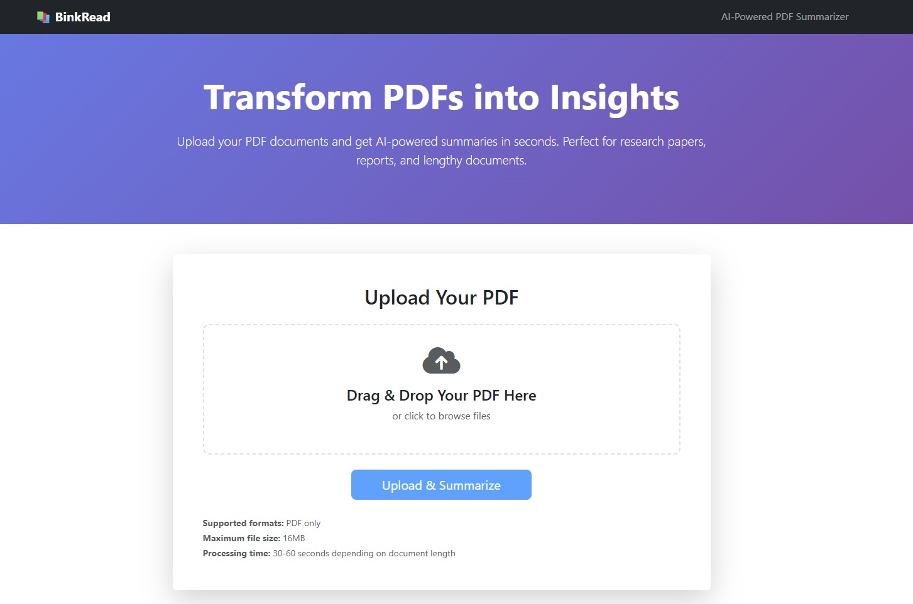

# BinkRead - AI-Powered PDF Summarizer



A modern Flask web application that uses Facebook's BART model to automatically summarize PDF documents. Perfect for researchers, students, and professionals who need quick insights from lengthy documents.

🔗 **Repository**: [https://github.com/Tuhin-SnapD/BinkRead](https://github.com/Tuhin-SnapD/BinkRead)

## Features

- 🚀 **Fast Processing**: Get summaries in seconds using state-of-the-art AI
- 🔒 **Secure & Private**: Documents are processed locally and never stored permanently
- 🧠 **Smart Summarization**: Advanced AI understands context and generates meaningful summaries
- 📱 **Modern UI**: Beautiful, responsive interface with drag-and-drop file upload
- ⚡ **Efficient**: Handles large documents by processing them in optimized chunks

## Installation

### Prerequisites

- Python 3.8 or higher
- pip (Python package manager)

### Setup

1. **Clone the repository**
   ```bash
   git clone https://github.com/Tuhin-SnapD/BinkRead.git
   cd BinkRead
   ```

2. **Create a virtual environment**
   ```bash
   python -m venv venv
   
   # On Windows
   venv\Scripts\activate
   
   # On macOS/Linux
   source venv/bin/activate
   ```

3. **Install dependencies**
   ```bash
   pip install -r requirements.txt
   ```

4. **Run the application**
   ```bash
   python app.py
   ```

5. **Open your browser**
   Navigate to `http://localhost:5000`

## Usage

1. **Upload a PDF**: Drag and drop your PDF file or click to browse
2. **Wait for Processing**: The AI will analyze and summarize your document
3. **Review Summary**: Get a comprehensive summary of your document
4. **Copy Results**: Use the copy button to save your summary

## Configuration

The application can be configured through environment variables:

- `FLASK_ENV`: Set to `production` for production deployment
- `SECRET_KEY`: Flask secret key for session management
- `PORT`: Port number for the application (default: 5000)
- `LOG_LEVEL`: Logging level (DEBUG, INFO, WARNING, ERROR)

## Technical Details

### Architecture

- **Backend**: Flask web framework
- **AI Model**: Facebook's BART-large-CNN for text summarization
- **PDF Processing**: PyMuPDF (fitz) for text extraction
- **Frontend**: Bootstrap 5 with custom JavaScript

### How It Works

1. **PDF Upload**: Files are temporarily stored and validated
2. **Text Extraction**: PyMuPDF extracts all text from the PDF
3. **Text Chunking**: Large documents are split into manageable chunks
4. **AI Summarization**: BART model processes each chunk
5. **Result Assembly**: Summaries are combined into a final result
6. **Cleanup**: Temporary files are automatically deleted

### Performance Considerations

- **Chunk Size**: Documents are processed in 4000-character chunks
- **Token Limits**: Chunks exceeding 1024 tokens are skipped
- **Memory Management**: Models are loaded once and reused
- **File Cleanup**: Temporary files are automatically removed

## API Endpoints

- `GET /`: Home page with upload form
- `POST /upload`: Handle PDF upload and summarization

## Error Handling

The application includes comprehensive error handling for:
- Invalid file types
- File size limits (16MB maximum)
- Empty or corrupted PDFs
- AI model processing errors
- Network and system errors

## Development

### Project Structure

```
BinkRead/
├── app.py                 # Main Flask application
├── config.py             # Configuration settings
├── pdf_processor.py      # PDF processing utilities
├── requirements.txt      # Python dependencies
├── templates/           # HTML templates
│   ├── base.html        # Base template
│   └── index.html       # Main page template
└── uploads/             # Temporary file storage
```

### Adding Features

1. **New AI Models**: Modify `pdf_processor.py` to support different models
2. **File Formats**: Extend `allowed_file()` function for additional formats
3. **UI Improvements**: Update templates in the `templates/` directory
4. **API Endpoints**: Add new routes in `app.py`

## Troubleshooting

### Common Issues

1. **Model Loading Errors**
   - Ensure you have sufficient RAM (4GB+ recommended)
   - Check internet connection for model downloads

2. **File Upload Issues**
   - Verify file is a valid PDF
   - Check file size is under 16MB
   - Ensure file is not password-protected

3. **Performance Issues**
   - Large documents may take longer to process
   - Consider reducing chunk size for very large files

### Logs

Check the console output for detailed error messages and processing information.

## License

This project is open source and available under the MIT License.

## Contributing

Contributions are welcome! Please feel free to submit issues and pull requests.

## Support

For support, please open an issue on the [GitHub repository](https://github.com/Tuhin-SnapD/BinkRead/issues).